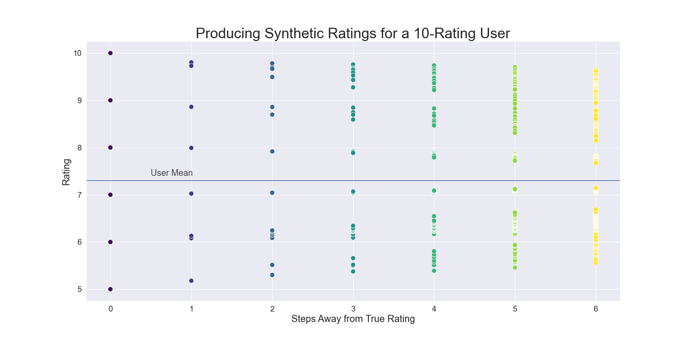

# BoardGameGeek Games Recommender System

By: Jen Wadkins

## Introduction

> This notebook series takes us through the entire process of sourcing, cleaning, exploring, and modeling user and game data from BoardGameGeek. The end product is a hybrid recommender system which leverages content-based similarities to support and strengthen a collaborative filtering system. The end system can be presented in one of two ways: For the new user, a cold-start protocol and memory-based collaborative filter are applied in a few seconds, and ratings are produced. For the returning user, model-based collaborative filtering in conjunction with the memory-based filter provide deeper recommendations.

> Content recommenders only work if the data is kept relevant and updated. To that end, I've developed a plan which will allow maintenance of the system at the lowest computational cost, while allowing the system to be available to make recommendations at all times to new users.

## Skills Presented

* Web Scraping
* API usage
* Data Cleaning
* Exploratory Data Analyis
* Data Visualization
* Feature Selection and Engineering
* Content-Based Filtering
* Collaborative Filtering with Statistical Methods and Surprise

## Business Objective and Questions

#### Business Objective

Build a content recommender for BoardGameGeek with a goal of addressing problems that are both common to recommenders in general, and specific to BGG: 
    
   * Cost of acquiring and maintaining data
   * Cold Start problems where new users and items are not a part of the system
   * Sparse matrix issue where in a system with lots of items, not many are rated by a subset of users, making neighbors difficult to identify
   * BGG specific problem: Reimplementatons/reskins of games result in separated user profiles when they should be similar
   * Deal with computational cost/time limitations when issuing recommendations

#### Intentions

We will address and solve these problems for this system:

   * Plan for fast data acquisition and cleaning to allowing frequent system updates
   * Address Cold Start problem with a specific new user plan
   * Overcome the sparse matrix problem with synthetic content-based data
   * Overcome the BGG-specific problem with synthetic content-based data
   * Deal with computational cost by offering on-the-fly recommendations in addition to deeper daily model update

## Methodology

We use the OSEMN for Data Science to organize the project.
* Obtain Data: Source data from BoardGameGeek
* Scrubbing/Cleaning Data: Clean and prepare data for model processing
* Exploring/Visualizing the Data: Perform EDA on data
* Model: Iteratively explore different models
* Analysis: Analyze and explain results

# Table of Contents

#### [BGG01_Obtaining_Primary.ipynb](https://github.com/threnjen/boardgamegeek/blob/main/BGG01_Obtaining_Primary.ipynb)

BGG01 involves the acquisition of game data from BoardGameGeek. Largely this is accomplished by XML API call, with some dynamic content scraped. Files are dumped to a "dirty" directory.

#### [BGG02_Obtaining_UserID.ipynb](https://github.com/threnjen/boardgamegeek/blob/main/BGG02_Obtaining_UserID.ipynb)

BGG02 involves the acquisition of user_id information from BoardGameGeek, using their XML API.

In this notebook, user apis are accessed one-by-one and the user information dumped dirty to file.

#### [BGG03_Scrubbing-Cleaning.ipynb](https://github.com/threnjen/boardgamegeek/blob/main/BGG03_Scrubbing-Cleaning.ipynb)

BGG03 is the scrubbing and cleaning of the various data obtained in notebooks BGG01 and BGG02. The following datasets are cleaned, constructed, or otherwise prepared for EDA and modeling.

   * Games
   * Mechanics
   * Subcategories
   * Designers
   * Artists
   * Publishers
   * Awards
   * Ratings Distribution
   * Comments
   * Ratings Matrix

#### [BGG04_EDA.ipynb](https://github.com/threnjen/boardgamegeek/blob/main/BGG04_EDA.ipynb)

BGG05 holds the EDA and visualization for the game data.

Most of this notebook is outside of the scope of the recommendation engine, and serves largely as a visualization and exploration playground to find interesting details about the data.

#### [BGG05_Content_Based.ipynb](https://github.com/threnjen/boardgamegeek/blob/main/BGG05_Content_Based.ipynb)

BGG05 is the building of a content-based item filter. Using category weights, I use my domain expertise to tune an item similarity matrix for all game IDs in the games file.

This content-based filter could be used as-is to find similar games to a user's catalog and predict ratings.

#### [BGG06_Synthetic_Ratings.ipynb](https://github.com/threnjen/boardgamegeek/blob/main/BGG06_Synthetic_Ratings.ipynb)

BGG06 is where synthetic ratings are produced for each user, using the content-based item filter from BGG05.

#### [BGG07_Build_Datasets.ipynb](https://github.com/threnjen/boardgamegeek/blob/main/BGG07_Build_Datasets.ipynb)

In BGG07 we build several large datasets, notably:

* Real Ratings Dictionaries and Longform(melted) Dataframes in both unscaled and scaled versions
* Synthetic Ratings Dictionaries and Longform Dataframes in both unscaled and scaled versions
* User Means lookup dictionary

These files are used in the Collaborative Filter (BGG08)

#### [BGG08_Collaborative_Filtering.ipynb](https://github.com/threnjen/boardgamegeek/blob/main/BGG08_Collaborative_Filtering.ipynb)

BGG08 contains the Collaborative Filtering model.

Th CF is tested in both memory and model-based modes, on both the user's real ratings data and the synthesized data sets.

Using testing results, we select the most efficient recommendation system and make our business recommendations.

## Analysis

>We started with 182,000 users rating the 22,500 most popular board games from BoardGameGeek. Most of the data was via the BGG API, with some scraped directly. After cleaning for users with more than 10 ratings we had 102,000 users remaining

##### The working of a Collaborative Recommender System 

>Our recommendation system uses a method called collaborative filtering. At its core this method finds items to recommend by relating people that like items in a similar way. The important word here is **similar**, not just that both users actually like the games. In this example that could mean both users hated Wingspan at the top and loved the other three in the middle. The model would conclude from this that blue and yellow are SIMILAR players. In our example the model recommends blue's favorites Nemesis and Rebellion to the yellow meeple, and yellow's favorites Terraforming Mars and Scythe to the blue meeple, after concluding that they have similar tastes in games.

### Collaborative Filtering Challenges

> We have a few general collaborative filter challenges to overcome, the first of which is a low number of user ratings which results in a sparse ratings matrix.

>Here we show from our data set the number of users vs the number of games rated. Our median number of games rated is 53 which is not that bad, but our data set is only made of users who have rated 10 or more, so our real-world median is going to be less. A fairly high number of users are in the 10-20 range; In fact 20% of our user set has rated 20 or fewer games. When this is spread over the 22,500 games in our game list, it becomes difficult to find the similar users like in the above venn diagram.

> Add to that a problem of how to start up a new user who has NO ratings for any items - where do they get recommendations to begin with? It's sensible to require a small amount of startup information, but without a lot of ratings, the recommendations may be poor.

> These are two large challenges that our recommender system seeks to overcome.

### BoardGameGeek specific challenge

##### The Monopoly Problem

> We add an additional problem which is unique to board gaming where there are a lot of games that are fundamentally the same but slight reskins. A great example of this is Monopoly, which has hundreds of different versions (and not even counting straight reskins like your local city-opoly). All these minor variations are different game entries even though at its core it is basically the same game. So purple, yellow, and red may all have rated these slightly different versions of Monopoly, but the basic collaborative filtering system cannot perceive those as the same and will not relate those users to each other. This is a domain specific problem because in music, movies, or books, different items are actually different items, no matter how similar they are. In board gaming, different items may be different themes or new editions of the same game.

> We overcome this problem in our data set by pulling in a second recommendation system based on **content-based filtering**. This system is very simple - it takes a user's item rating,  finds similar items to that item, and predicts a rating for each new item based on how similar it is. Other users never enter the picture at all - all that matters is the items that have been rated. This system requires domain-specific knowledge to design and tune.

> Content-based filtering can be a recommendation system all in itself, but it doesn't perform as well as collaborative filtering. So how are we leveraging it? We use our content-based filter to produce synthetic ratings for users in order to increase their overall number of ratings and provide a fuller ratings matrix.

> In doing so we overcome two of our collaborative filtering problems - first, we increase user ratings and **improve sparse ratings matrix**, and second, the **BGG-specific problem** of different item editions is resolved. When we produce synthetic ratings, different item editions are the most similar items, and will inevitably have ratings produced for them.

> Below is an image of what it looks like in a user's profile when we synthesize ratings. Here we have taken a user who started with only 10 ratings, and we synthesized using like-content until we reached 250 ratings. The ratings are synthesized exponentially, and gradually the values will move toward the user's mean, which is the horizontal line. We get all of our ratings well before this happens. We end up with a lot of quality ratings in the user's profile. This takes 1-2 seconds to produce, so doing this with a new user in the system is reasonably quick.

### How do we evaluate the quality of the recommender?

> Now we have a method and have overcome some of our problems - how do we evaluate our recommender?

> First we must define what it means to have a recommendation. A **RECOMMENDED** item is a game that the user will like more than their average. A user's average is relevant only to themselves. If John is a tough rater and his average is a 6, and Mike is a generous rater and his average is an 8, the numbers don't really matter. What we want to see is games that the user will like more than their personal average. Each user's overall rating bias is mathematically removed from the system, leaving only their differential for a given item above or below their average.

> A **RELEVANT** item is any game that the user actually rates more than their average.

> We determine if a recommender is successful if it correctly identifies the user's relevant items as recommended items. We want all of the items that the user actually likes more than their average, to be predicted by the recommender as being more than their average. This is called RECALL. A recall of 100% is preferable, meaning the system succesfully predicted all of the user's relevant games as recommended. However we also want a "reasonable" raw prediction error while we do this.

> Defining "reasonable" here is a little hazy because there quickly becomes a point where a ratings error difference is minutiae. There's a lot of difference between a 6 and an 8 rating, but not a lot of difference between a 7 and a 7.1. This is why once we have an acceptable error, we are MORE interested in whether or not the system can correctly identify the user's relevant items.

> We're also interested in improving our catalog's coverage, and increasing the total number of recommended items in the system to include less popular items. While improving rating diversity is part of future work, we can still evaluate coverage improvements as we add synthetic ratings.

### The Cold Start Problem

> We will address in common fashion with user questionnaire
   * Ask category questions for "What kind of board games do you like to play?”, allow multiple category selections
   * Select favorite mechanics, allow multiple selections
   * Show a set of games in those categories and ask them to rate at least 5
   * Generate synthetic ratings

> There was insufficient time to implement the cold start in this project, and it has become part of Future Work

### Dealing with computational cost

> Getting recommendations via Model is time consuming, and the user must be part of the system in order to produce recommendations. A plan must be in place to produce recommendations FAST for users.

> Recommendations via statistical methods (Memory Method) are relatively quick. In general, the Memory method should be used for:
- New Users
- Users who have updated their profile

> The machine learning model can be compiled and upated daily in about 30 minutes, and will produce recommendations for a user quickly.

## Future Work

* Evaluate diversity in recommendations and retune content recommender to fit goals
* Next task - implement the cold start questionnaire
* Find the sweet spot of synthetic ratings for recommendation time
* Set up on-the-fly implementation and daily model deployment
* Deploy GUI

## Presentation
[Video - Data Science Capstone](https://www.youtube.com/watch?v=y9XZ5QLS2dU&ab_channel=JennyWadkins)

[PDF of Presentation](https://github.com/threnjen/austin_housing_prices/blob/main/mod_4_pdf/Austin_Housing_Study.pdf)
