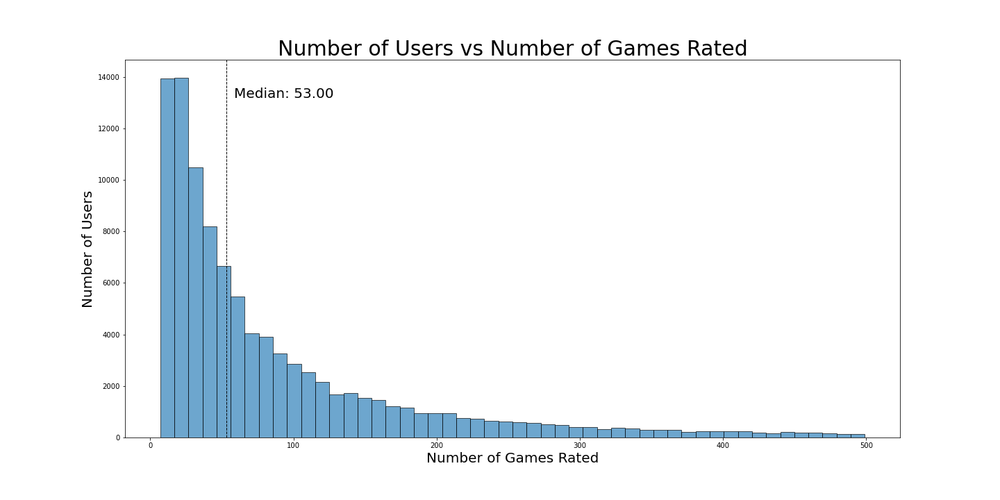
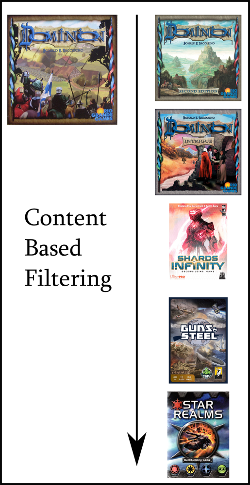
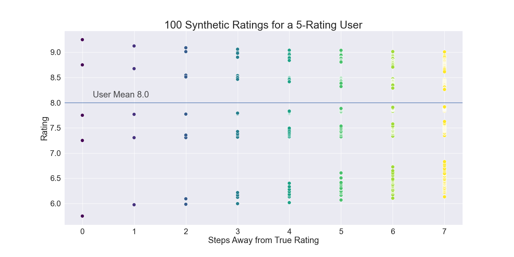

# BoardGameGeek Games Recommender System

By: Jen Wadkins

## Introduction

> This notebook series takes us through the entire process of sourcing, cleaning, exploring, and modeling user and game data from BoardGameGeek. The end product is a hybrid recommender system which leverages content-based similarities to support and strengthen a collaborative filtering system. The end system can be presented in one of two ways: For the new user, a cold-start protocol and ratings are synthesized, then a memory-based collaborative filter is applied and recommendations are produced. For the returning user, ratings are synthesized if needed, then memory-based collaborative filtering provides fast recommendations.

> Content recommenders only work if the data is kept relevant and updated. To that end, I've developed a plan which will allow maintenance of the system at the lowest computational cost, while allowing the system to be available to make recommendations at all times to new users.

## Skills Presented

* Web Scraping
* API usage
* Data Cleaning
* Exploratory Data Analyis
* Data Visualization
* Feature Selection and Engineering
* Content-Based Filtering
* Collaborative Filtering with Statistical Methods and Surprise

## Business Objective and Questions

#### Business Objective

Build a content recommender for BoardGameGeek with a goal of addressing the following challenges that are both common to recommenders in general, and specific to BGG:

- Cost of acquiring and maintaining data
- Cold Start problems where new users and items are not a part of the system
- Catalog coverage problems where popularity bias results in items of the catalog that are not in the recommendation system
- Sparse matrix issue where a combination of many items, many users, and few ratings results in low user/item crossover for identifying neighbors
- BGG specific problem where reimplementatons/reskins of games result in separated user profiles when they should be similar
- Computational cost/time limitations when issuing recommendations
   

## Methodology

We use the OSEMN for Data Science to organize the project.
* Obtain Data: Source data from BoardGameGeek
* Scrubbing/Cleaning Data: Clean and prepare data for model processing
* Exploring/Visualizing the Data: Perform EDA on data
* Model: Iteratively explore different models
* Analysis: Analyze and explain results

# Table of Contents

#### [BGG01_Data_Pull.ipynb](https://github.com/threnjen/boardgamegeek/blob/main/BGG01_Data_Pull.ipynb)

BGG01 involves the acquisition of game data from BoardGameGeek. Largely this is accomplished by XML API call using Scrapy. Files are dumped to a "dirty" directory and then the XML is processed using BeautifulSoup or lxml.

#### [BGG02_Scrubbing-Cleaning.ipynb](https://github.com/threnjen/boardgamegeek/blob/main/BGG02_Scrubbing-Cleaning.ipynb)

BGG03 is the scrubbing and cleaning of the various data obtained in notebooks BGG01 and BGG02. The following datasets are cleaned, constructed, or otherwise prepared for EDA and modeling.

   * Games
   * Mechanics
   * Subcategories
   * Designers
   * Artists
   * Publishers
   * Awards
   * Ratings Distribution
   * Comments
   * Ratings Matrix

#### [BGG03_EDA.ipynb](https://github.com/threnjen/boardgamegeek/blob/main/BGG03_EDA.ipynb)

BGG05 holds the EDA and visualization for the game data.

Most of this notebook is outside of the scope of the recommendation engine, and serves largely as a visualization and exploration playground to find interesting details about the data.

#### [BGG04_Content_Based.ipynb](https://github.com/threnjen/boardgamegeek/blob/main/BGG04_Content_Based.ipynb)

BGG05 is the building of a content-based item filter. Using category weights, I use my domain expertise to tune an item similarity matrix for all game IDs in the games file.

This content-based filter could be used as-is to find similar games to a user's catalog and predict ratings.

#### [BGG05_Synthetic_Ratings_Production.ipynb](https://github.com/threnjen/boardgamegeek/blob/main/BGG05_Synthetic_Ratings_Production.ipynb)

BGG06 is where synthetic ratings are produced for each user, using the content-based item filter from BGG04.

#### [BGG06_Similarity_Calculations.ipynb](https://github.com/threnjen/boardgamegeek/blob/main/BGG06_Similarity_Calculations.ipynb)

BGG06 is where similarity calculations are made between items, based on user ratings.

#### [BGG07_Clean_Process_Similarity_Files.ipynb](https://github.com/threnjen/boardgamegeek/blob/main/BGG07_Clean_Process_Similarity_Files.ipynb)

BGG06 is where similarity calculations are made between items, based on user ratings.

#### [BGG08_Build_Datasets.ipynb](https://github.com/threnjen/boardgamegeek/blob/main/BGG08_Build_Datasets.ipynb)

In BGG07 we build several large datasets in preparation for the collaborative filter, notably:

* User's Real Ratings Dictionaries and Longform(melted) Dataframes in both unscaled and scaled versions
* User's Synthetic Ratings Dictionaries and Longform Dataframes in both unscaled and scaled versions
* User Means lookup dictionary

These files are used in the Collaborative Filter (BGG08)

#### [BGG08_Collaborative_Filtering.ipynb](https://github.com/threnjen/boardgamegeek/blob/main/BGG08_Collaborative_Filtering.ipynb)

BGG08 contains the Collaborative Filtering model.

The CF is tested in both memory and model-based modes, on both the user's real ratings data and the synthesized data sets.

Using testing results, we select the most efficient recommendation system, make our business recommendations, and determine the solutions to the collaborative filter challenges.

#### [BGG09_Recommendation_Flow.ipynb](https://github.com/threnjen/boardgamegeek/blob/main/BGG09_Recommendation_Flow.ipynb)

BGG09 has a complete single-user recommendation flow

## Analysis

>We started with 182,000 users rating the 22,500 most popular board games from BoardGameGeek. After cleaning for users with more than 5 ratings there were 117,000 users remaining. Most data was obtained via the BGG API, with some scraped directly. A recommender system integrated into the BGG website would allow focused advertising opportunities. If BGG could place advertisers directly on the pages of most relevance to their product, customer clickthrough would increase, benefiting both BGG and the game publisher.

##### The working of a Collaborative Recommender System 

> Our recommendation system uses collaborative filtering. This method recommends items by first finding people that rate items in a similar way. The important word here is **similar**, not just that both users must like the items. In the above example, this would mean both users hated Wingspan at the top and loved or liked the other three in the middle. The model would conclude that blue and yellow are SIMILAR users. Once the recommender identifies similar users, it will recommend each user's favored items to the other user. In our example the model recommends blue's favorites Nemesis and Rebellion to the yellow meeple, and yellow's favorites Terraforming Mars and Scythe to the blue meeple, after concluding that they have similar tastes in games.

### Collaborative Filtering Challenges

> There are a few general collaborative filter challenges to address and overcome.

> First is the cost of acquiring and maintaining our data. Our system should be easy to keep updated and clean.

> Next is our computational cost of recommendation, which will be vital if we use machine learning. A collaborative filter using a package such as Surprise requires that a user be present in the system to obtain recommendations. This can be costly in terms of both computational power and time, especiallyif a user is awaiting real-time recommendations.

> Next is a challenge of adequate catalog coverage. Collaborative Filters can often leave out large sections of a catalog and never recommend them due to an overall popularity bias. Our solution explicitly improves catalog coverage.

#### Challenge in Detail: The Sparse Ratings Matrix

> Our final common challenge arises where a high number of items and low number of user ratings results in a sparse ratings matrix.

>Here our data shows the number of users vs the number of games they rated.  The median number of games rated is 43 which is adequate. However our data set is only made of users who have rated 5 or more, so our real-world median will be less. A fairly high number of users are in the 5-20 range; in fact 29.7% of our user set has rated 20 or fewer games. When this is spread over the 22,500 items in our  catalog, it becomes difficult to find the similar users like in our above venn diagram.

> Add to that a problem of how to start up a new user who has NO ratings for any items - where do they get recommendations to begin with? It's sensible to require a small amount of startup information, but without a lot of ratings, the recommendations may be poor. We'll be addressing this "cold-start problem" in a standard fashion with an introductory questionnaire, which I have have allocated to future work, but we'll also be boosting all of these low-ratings users with our custom collaborative filtering solution.

#### Challenge in Detail: BoardGameGeek Specific Problem

> We have an additional challenge which is unique to board gaming where there are many games that are fundamentally the same but slight reskins. A great example of this is Monopoly, which has hundreds of different versions (and not even counting straight reskins like your local city-opoly). All these minor variations are different game entries even though at its core it is essentially the same game. Purple, yellow, and red may all have rated these slightly different versions of Monopoly, but the basic collaborative filtering system cannot perceive those as the same and will not relate those users to each other. This is a domain specific problem because in music, movies, or books, different items are actually different items, no matter how similar they are. In board gaming, different items may be different themes or new editions of the same game.

> We overcome this problem in our data set by pulling in a second recommendation system based on **content-based filtering**. This method is very simple - it takes a user's item rating,  finds similar items to that item, and predicts a rating for each similar item using the user's original rating and how similar the new item is. Other users never enter the picture at all - all that matters is the items that have been rated. This system requires domain-specific knowledge to design and tune, but can be kickstarted with unsupervised learning.

> In the below image we see the results of unsupervised learning to assist in identifying the important features that determine game similarity. Using various UMAP plots, I was able to identify areas of interest that highly influence a game's similarity to another game. You can see in this graphic the strong groupings for certain game types, as well as game weight/complexity.

#### The Custom Recommender System

> Content-based filtering can be a recommendation system all in itself, but it doesn't perform as well as collaborative filtering. So how do we leverage it? We use our content-based filter to produce synthetic ratings for users in order to increase their overall number of ratings and provide a fuller ratings matrix, creating a **Synthetic Ratings Collaborative Filter**.

> Below is an image of what it looks like in a user's profile when we synthesize ratings. Here we have taken a user who started with only 5 ratings, and we synthesized using like-content until we reached 100 ratings. The ratings are synthesized exponentially, and gradually the values will move toward the user's mean, which is the horizontal line. We get all of our ratings well before this happens. We end up with many quality ratings in the user's profile. This takes less than 1 second to produce up to 100 ratings, so doing this with a new user in the system is reasonably quick.

> With our **Synthetic Ratings Collaborative Filter** we overcome several of our collaborative filtering problems - first, we increase user ratings and **improve the sparse ratings matrix**. Second, the **BGG-specific problem** of different item editions is resolved. When we produce synthetic ratings, different item editions are the most similar items, and will inevitably have ratings produced for them. Finally, our **Catalog Coverage** significantly improves. Since synthetic ratings are produced from the content-based filter which does not care about game popularity, we bring additional catalog titles into our system, which are then passed to other users.

### How do we evaluate the quality of the recommender?

> Now we have a method and have overcome some of our problems - how do we evaluate our recommender?

> First we must define what it means to have a recommendation. A **RECOMMENDED** item is a game that the user will like more than their average. A user's average is relevant only to themselves. If John is a tough rater and his average is a 6, and Mike is a generous rater and his average is an 8, the numbers don't really matter. What we want to see is games that the user will like more than their personal average. Each user's overall rating bias is mathematically removed from the system, leaving only their differential for a given item above or below their average.

> A **RELEVANT** item is any game that the user actually rates more than their average.

> Part of a recommender's success is if it correctly identifies the user's relevant items as recommended items. We want all of the items that the user actually likes more than their average, to be predicted by the recommender as being more than their average. This is called RECALL. A recall of 100% is preferable, meaning the system succesfully predicted all of the user's relevant games as recommended. However we also want a reasonable raw prediction error while we do this.

> Defining "reasonable" here is a little hazy because there becomes a point where a ratings error difference is minutiae. There's a large difference between a 6 and an 8 rating, but not a large difference between a 7 and a 7.1. Once we have an acceptable error, we are interested in whether or not the system can correctly identify the user's relevant items.

> We're also interested in improving our catalog's coverage, and increasing the total number of recommended items in the system to include less popular items. This eliminates the popularity bias common to collaborative filtes, by offering less popular titles to users that they may not have otherwise considered.

### Model Results

> How does synthetic data improve our recommender? We tried the recommender with real data, and boosting to 100 ratings, and had some interesting results.

> Using our synthetic data, we had an overall reduction to our user error - MAE and RMSE went down. However MAE/RMSE went down only for users under the median, which I would argue are the users that we most want to improve recommendations for. For these users, the reduction in user error was significant. Our users over the median saw an increase in error.
> Overall, the changes to error were very minor. As previously mentioned, there is not a large functional difference between a 7 and a 7.1 rating, and our absolute error decay in users over the mean was only .026. Our overall improvement for all users was only .044.

> **MAE**  
- ALL Users ▼ 7.66% MAE improvement from .571 to .527
- Users UNDER median ▼ 18.39% MAE improvement from .608 to .497
- Users OVER median ▲ 4.86% MAE deterioration from .533 to .559

> **RMSE** 
- ALL Users ▼ 3.79% Users RMSE improvement from .730 to .703
- UNDER median ▼ 13.98% RMSE improvement from .769 to .661
- Users OVER median ▲ 7.82% RMSE deterioration from .691 to .745

> The synthetic data resulted in a slight reduction to our recall, meaning the system's ability to accurately classify a user's relevant items at recommended. This was true for all user groups. This is undesirable, and if we cannot resolve it with further content tuning, it should be considered if the synthetic system is a true improvement.

> **Recall** 
- ALL Users ▼ 5.82% Recall deterioration from 61.75% to 58.15%
- Users UNDER median ▼ 5.6% Recall deterioration from 59.3% to 56%
- Users OVER median ▼ 5.96% Recall deterioration from 64.3% to 60.4%

> Finally, the system had a large increase in catalog coverage, especially for those users over the median. We achieved a far higher level of recommendation diversity when using the synthetic data, because the content-based recommender doesn't know how popular an item is, and populates the synthetic ratings with more diverse recommendations. This overcomes a large challenge to recommender systems, and is a desirable result.

> **Catalog Coverage**
- ALL Users ▲ 9.69% Coverage Improvement from 83.93% to 92.06%
- Users UNDER median ▲ 9.59% Coverage Improvement from 83.64% to 91.66%
- Users OVER median ▲ 49.17% Coverage Improvement from 54.89% to 81.88%

> The huge increase to catalog coverage coupled with an increase to error was an interesting result for the users over the median. The much lower base catalog coverage for this group implies that as number of reviews grow, those reviews tend to coalesce around the more popular items.

### The Recommender Model

> Our final model uses accepted memory-based statistical methods to evaluate a user's local neighborhood and provide recommendations. Memory-based methods were far superior to Model-based methods in testing and evaluation, and have the added advantage of improved speed and lower computational cost. A model-based recommender built in the Surprise package requires that a user be part of the model training, making it incompatible for a new user to the system. Statistical based methods incorporate new users immediately. 

> Our method takes the following steps to produce recommendations:
- User averages are removed from the user's ratings to remove their personal bias and center all ratings around 0
- If the user has fewer than 5 ratings, will implement a Cold Start protocol to obtain baseline information
- If the user has fewer than 100 ratings, synthesizes ratings to 100 using the content-based similarity filter and the user's existing ratings
- Defines potential neighbors as other users with at least 5 items in common.
- Evaluates user's cosine similarity to each potential neighbor. Similarity is calculated on all items rated in common, with the minimum of 5
- System defines neighbors over .8 similarity as part of neighborhood (entire potential neighborhood would be valid, but we provide cutoff for computational cost reasons)
- Any item rated by at least 5 neighbors produces an item rating for the user, which is weighted by each contributing neighbor's similarity
- Items rated above 0 are served as recommendations (user's mean is added back for presentation)

### Meeting our Objectives

#### Plan for fast data acquisition and cleaning to allowing frequent system updates
The basic data update can be done in as little as 30 minutes a day via API and can be entirely automated through the acquisition and cleaning steps.

#### Deal with computational cost of recommendation system
Our end model is purely mathematical and requires no ongoing maintenance or model deployment. It does not use machine learning and instead uses statistical methods, allowing a user to receive a recommendation within seconds.

#### Address Cold Start problem with a specific new user plan
Address in common fashion with user questionnaire:
- Ask category questions for "What kind of board games do you like to play?”, allow multiple category selections
- Select favorite mechanics, allow multiple selections
- Show a set of games in those categories and ask them to rate at least 5
- Generate synthetic ratings
- Generate recommendations

There was insufficient time to implement the cold start in this project, and it has become part of Future Work

#### Overcome catalog coverage challenge using synthetic content-based data
Since synthetic ratings are produced from the content-based filter which does not care about game popularity, we bring additional catalog titles into our system, which are then passed to other users.

#### Overcome the sparse matrix challenge using synthetic content-based data
In a synthetic system, all users have a minimum n ratings with which to locate neighbors. More matches are made and quality neighbors located.

#### Overcome the BGG-specific challenge using synthetic content-based data
Synthetic data accounts for and bridges the gaps of similar-but-different content by adding ratings for these items to a user's profile.

## Future Work

- The quality of the synthetic collaborative system is entirely dependent on the hand-tuned quality of the content-based system. Based on the preliminary improvements with the synthetic data, I am confident that with more tuning work on the content-based system I can further improve the quality to where Recall is also improved.

- We need to find our sweet spot of synthetic ratings to recommendation time. Users want results fast, so we need to give those results while also having a quality system. In my example I synthesized data to 100 ratings, but we should check timing with 50, 75, etc. Again, this was simply a time issue where I ran out of time for further testing.

- Our next task is to implement the cold start plan to integrate our new users.

- Finally, we will deploy our user GUI and the system will be usable.

## Presentation
[Video - Data Science Capstone](https://youtu.be/D7XPFbMjBAI)

[PDF of Presentation](https://github.com/threnjen/boardgamegeek/blob/main/BGG.pdf)
